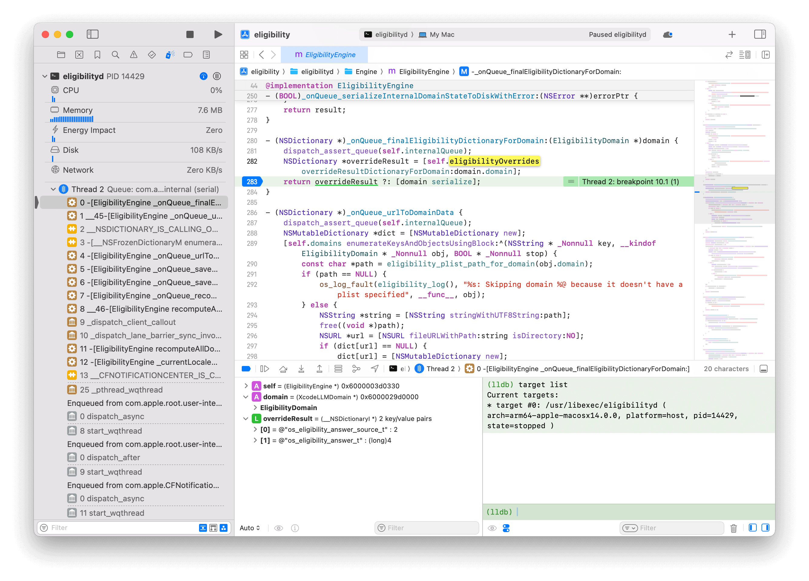

> Licensed under CC BY-SA 4.0
> Modified with source: https://stackoverflow.com/a/73422893/10596982 & https://qr.ae/p2nHme

# How to debug eligibilityd on macOS



## Replace the system's eligibilityd binary with our custom one with debug info

1. Disable FileVault
2. Reboot into recovery mode and run the following commands in Terminal

```shell
csrutil disable                     # disable System Integrity Protection (SIP)
csrutil authenticated-root disable  # disable Signed System Volume (SSV)
reboot                              # restart the computer
```

3. After reboot back into normal macOS, mount a writable copy of the System Volume in a convenient location

For example, create a subdirectory of `$HOME` called `rootmount`:

```shell
mkdir ~/rootmount 
```

Identify the System Volume by searching for the string sealed in the output of mount:

```shell
mount | grep sealed
```

This should return seveal lines with something similar to:

```shell
/dev/disk3s1s1 on / (apfs, sealed, local, read-only, journaled)
/dev/disk6s1 on /Library/Developer/CoreSimulator/Volumes/iOS_22A5282m (apfs, sealed, local, nodev, nosuid, read-only, journaled, noowners, noatime, nobrowse)
```

The listed device is the currently mounted snapshot of the System Volume.

The System Volume itself is the same, except without the final s1. While device numbers may vary,
in this example the command to mount the System Volume would be:

```shell
sudo mount -o nobrowse -t apfs /dev/disk3s1 ~/rootmount
```
A writable copy of the System Volume is now mounted at ~/rootmount. Changes to the volume can be made.

4. Modify the files under the mounted directory

```shell
cd ~/rootmount
cd usr/libexec
# Modifications will require superuser privileges
sudo mv eligibilityd eligibility.old.backup # backup the original system binary
sudo mv <our debug build of eligibilityd> eligibilityd
```

5. Create a snapshot of the modified volume

After making changes, the modified copy of the System Volume must be marked as a bootable snapshot using bless.

To create a snapshot of the modified volume, mark it as bootable, and set it as the new boot volume, run:

```shell
## on Intel Macs:
sudo bless --folder ~/rootmount/System/Library/CoreServices \
    --bootefi --create-snapshot

## on Apple Silicon:
sudo bless --mount ~/rootmount/System/Library/CoreServices \
    --bootefi --create-snapshot
```

Finally, reboot.

The changes should be visible and should persist until SIP or SSV is re-enabled or the operating system is updated.

## Debugging

- Open eligibility project in Xcode
- Go to `Debug` -> `Attach to Process by PID or Name...`
- Enter `eligibilityd` in the search box and choose "Debug process as root"
- Set breakpoints in the project and happy debugging 🎉
